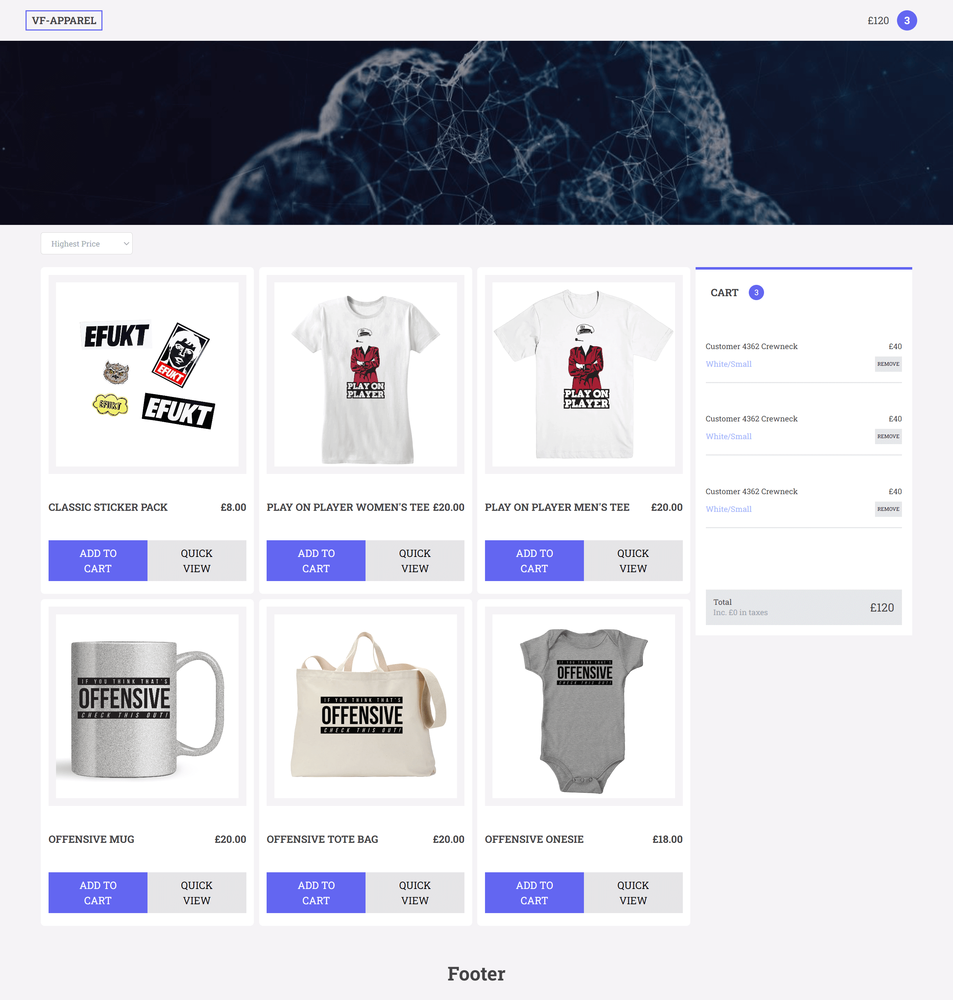
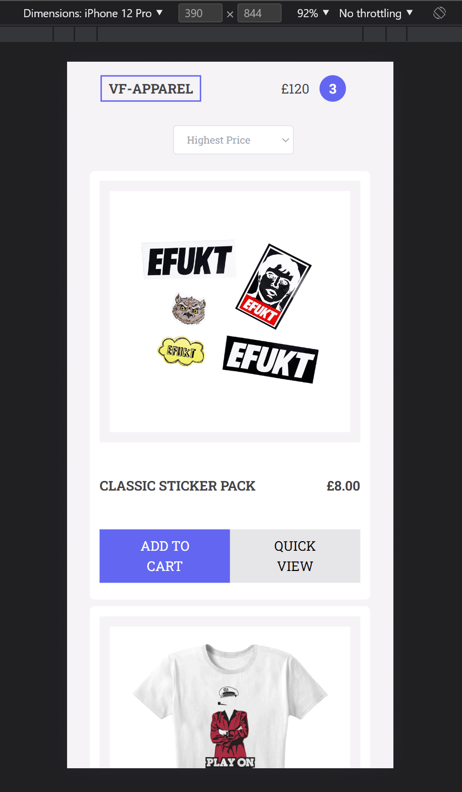

<div  align="center">


</div>


<h1  align="center">

🖥 "ShoppingApp" - Vue.js 3 + TailwindCSS 📱

</h1>


## 🗃 Project

Responsively home page for a webcommerce fetching dynamic data from a Shopify standart RESTful API.

</br>


## 🛠 Technologies

This project was developed with the following technologies:

   **JavaScript**

   **Vue.js**

   **Vite.js**

   **TailwindCSS**


</br>


## 💻 Demonstration


<h5 align="center"> 🔗 Online: https://vue-vftest.vercel.app/</h5>

</br>
<p  align="center">
  <h5 align="center">🖥 Desktop:</h5>
  <kbd>

</kbd>
</p>
  <h5 align="center">📱 Mobile:</h5>
<p  align="center">
<kbd>

</kbd>
</p>

</br>

## 🚀 How to run

If you want to run the project on your local machine, just follow the steps below:

```bash
$ git clone https://github.com/guilhermemm-dev/vue-vftest

# Install the dependencies

$ yarn install or npm install

# Run

$ yarn run dev or npm run dev

```

```bash
⚠ Attention: Before run the App, don't forget to add an ".env" file at the root folder of the project with the api url as shown in the "env.example" file
```


</br>

## 📝 License


This project is licensed under the MIT license.


</p>


</br>
<hr/>
</br>


<h3> Guilherme Martins - @guilhermemm-dev </h3>

- Portfolio: https://guilhermemm.dev

- LinkedIn: https://www.linkedin.com/in/guilhermemm-dev

- GitHub: https://github.com/guilhermemm-dev

- Email: guilhermemm.dev@gmail.com
